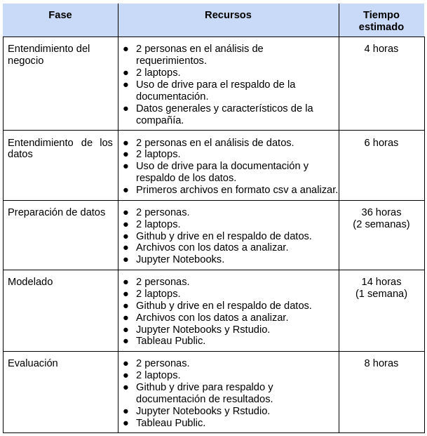
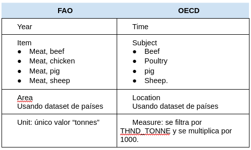
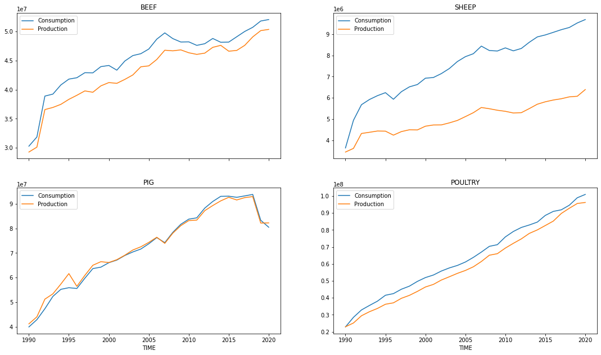
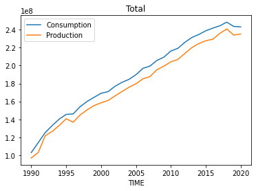
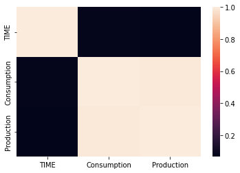
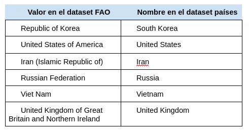

```{r setup, include=FALSE, echo=FALSE}
knitr::opts_chunk$set(echo = TRUE)

library(kableExtra) # render de tablas
library(keras) # for deep learning
library(tidyverse) # general utility functions
library(caret) # machine learning utility functions
```

# Entendimiento del negocio

## Determinar los objetivos de negocio

### Objetivos de negocio

1.  Investigar e identificar los consumos de carne en el transcurso de los años, de regiones específicas, para aplicar un análisis de viabilidad en la producción de ciertos grupos cárnicos, de acuerdo a la región de análisis.

2.  Obtener un criterio sobre estos consumos contra producción, para así presupuestar una inversión futura en la producción de productos con los consumos más elevados o con tendencia a un crecimiento.

3.  Prever la demanda de productos cárnicos específicos en la región para los futuros años.

4.  Analizar la posibilidad de disminución o eliminación de la producción, inversión o presupuestación de algún producto cárnico poco consumido o con tendencias a disminuir.

5.  Determinar si el rumbo de producción se verá afectado por consumos futuros en las regiones de distribución de los distintos grupos cárnicos analizados.

### Criterios de éxito

1.  Se realiza un incremento de la inversión en la producción de los productos cárnicos específicos de acuerdo a las demandas de consumo, donde se tiene una producción no suficiente.

2.  Se logra un incremento de ventas de los productos producidos en un 10% anual.

3.  Disminución de los desperdicios de carnes al llevar a cabo una producción más acertada en al menos un 5%, se busca una meta de desperdicios de solo un 2%.

4.  Aumento de las ganancias al mantener la producción de los productos más consumidos y evitar la pérdida de los productos menos consumidos, se esperan obtener márgenes de al menos un 30%.

5.  Disminución de costes en desecho de productos no consumidos por desperdicios al almacenar, ya sea por una demanda baja o porque no logró salir del inventario, o sobre exceso de producción de productos que noten una variación amplia de consumo contra producción.

## Evaluación de la situación actual

### Inventario de recursos

Por parte de la empresa, ésta cuenta con los archivos digitales de estudios de consumo y producción de diferentes países del mundo obtenidos de internet.

Las fuentes de almacenamiento serán a nivel de la nube y manejados en distintos sitios web, como google drive para el almacenamiento de documentos, tableau public para el manejo visual de los análisis (dado que por ahora no se contarán con licencias), github para respaldos y almacenamiento de códigos.
Se aplicará como software de programación R, por que se usarán los programas Rstudio y Jupyter Notebooks.

A nivel físico y de personal, se contarán con 2 computadoras, junto con 2 personas del área de TI y Análisis.

### Requerimientos

Actualmente la empresa cuenta con una serie de problemas en el análisis de datos, ya que no tiene una forma de visualización clara o eficiente, lo que impide llevar a cabo una serie de objetivos de planeación.

Por lo anterior, se requiere una serie de visualizaciones que permitan el análisis de los valores de consumo y producción por año de los grupos cárnicos utilizados en los países de las sucursales del negocio y su tendencia en el ámbito internacional.
Esto, de ser posible, por medio de un dashboard que reúna los gráficos pertinentes.

Además, se requiere una predicción de consumo/producción futuro, para así lograr cumplir las previsiones de presupuestos y estimaciones de la empresa.
Esto con el fin de realizar mejores inversiones en los productos con mayor demanda.

### Supuestos

1.  Los archivos de los análisis de los datos mostrarán información verídica, confiable y completa.

2.  Las licencias, a pesar de ser libres, bastarán para cumplir los objetivos de la minería de datos.

3.  Los desarrolladores y analistas tendrán el suficiente conocimiento y entendimiento del proyecto para llevar a cabo los objetivos.

4.  El resultado final será suficiente para llevar a cabo los análisis y predicciones requeridas.

### Restricciones

1.  Se cuenta solo con 2 personas del área de desarrollo de software para elaboración del proyecto, por lo tanto, se limita el conocimiento del área cárnica.

2.  Se cuenta con 2 laptops para la elaboración del proyecto del proyecto, una por desarrollador.

3.  Por un tema de reducción de costos, se utilizará Tableau Public a sabiendas que existen limitantes en las funcionalidades.

4.  Se cuenta con una fecha de entrega determinada sin posibilidades de retrasos.

5.  Se cuentan con datos reales hasta el 2020.

### Riesgos y contingencias

1.  Existe el riesgo de no cumplir con el plazo de tiempo.
    En caso de cercanías de la entrega se deberán hacer extras para la finalización del mismo.

2.  Problemas técnicos o de perdida de equipo.
    Como contingencia se deberá mantener un respaldo constante utilizando github o Google drive.

3.  Problemas con los datos suministrados.
    Dado que se podrían ver serios retrasos, se debe aplicar una selección y limpieza lo antes posible.
    De no ocurrir, podría materializarse el riesgo descrito en el primer punto sobre no cumplir el plazo.

### Beneficios

A un nivel costo beneficio, se espera que el proyecto brinde estimaciones de consumos de productos cárnicos específicos, de manera que se pueda definir una producción óptima, evitando así problemas de sobreproducción o, caso contrario, se produzca menos comparado con la demanda del mercado.

A nivel de planeación, se espera disminuir el tiempo de análisis al tener una mejor visualización de las tendencias de consumo y producción.
Ello permitiría un mejor uso presupuestario con respecto a la inversión en productos de mayor consumo, por ende aumentar las ventas y evitar pérdidas por sobreproducción.

## Plan del proyecto

### Recursos



### Evaluación inicial de herramientas y técnicas

Dado que como los consumos son precedidos por un tema de linealidad de tiempo, donde tanto el consumo como la producción tienden a tomar un incremento en el transcurso del tiempo, el tiempo se convierte en un atributo donde el orden importa.

Por lo que se decidió aplicar una serie de tiempo con un red neuronal recurrente (RNN).
Para el caso de las métricas se utilizarán el RMSE (error cuadrático medio), el MAPE (Mean Absolute Percent Error), y el r-squared score.
Esto se aplicará en R para la creación de los modelos.

## Determinar los objetivos de minería de datos

### Objetivos de minería de datos

El objetivo de la minería de datos es predecir el consumo y la producción anuales de los países de interés en cuatro tipos de productos cárnicos para los próximos 2 años de datos.

### Criterios de éxito (desde la perspectiva de minería de datos)

Como éxito se espera que la predicción antes mencionada tenga un nivel de confianza de al menos 80%.

# Fase de entendimiento de los datos

## Recopilación inicial de datos

### Lista de fuentes de datos requeridos

1.  OECD, Consumo de carne.
    Conjunto de datos sobre el consumo de carne mundial, datos recopilados y filtrados por la Organización para la Cooperación Económica y Desarrollo - [OECD](https://data.oecd.org/) por sus siglas en inglés.
    Los datos son un subconjunto de los datos emitidos por el reporte [OECD-FAO Agricultural Outlook (Edition 2021)](https://www.oecd-ilibrary.org/agriculture-and-food/data/oecd-agriculture-statistics/oecd-fao-agricultural-outlook-edition-2021_4bde2d83-en), que incluye datos desde 1970 con proyecciones para los años 2021-2029, y que cubre estadísticas sobre mercados como cereales, aceite de semillas, productos lácteos, algodón y otros.

2.  ISO, Códigos de los países.
    Utilizados para hacer uniones entre diferentes conjuntos de datos.

3.  FAO, Cultivos y productos ganaderos.
    Este reporte emitido por la Organización de Comida y Agricultura de la ONU (FAO por sus siglas en inglés) contiene la cantidad de carne producida por cada país.
    Actualizado por última vez en Febrero de 2022.

### Método de acceso

1.  Consumo de carne.
    Los datos recopilados por la OECD se encuentran públicamente accesibles desde su sitio web, en particular el [reporte sobre consumo de carne](https://data.oecd.org/agroutput/meat-consumption.htm).

2.  ISO Country Codes - Global.
    Acceso público en el sitio de [kaggle](https://www.kaggle.com/datasets/andradaolteanu/iso-country-codes-global).

3.  Cultivos y productos ganaderos.
    Datos exportados desde la página de [estadísticas de la FAO](https://www.fao.org/faostat/en/#data/QCL), en formato CSV sin separador de miles, utilizando los siguientes filtros:

    a.  Países: "todos"

    b.  Ítemes:

        i.  Meat, cattle

        ii. Meat, chicken

        iii. Meat, pig

        iv. Meat, sheep

    c.  Elementos: "Production Quantity".

    d.  Años: "todos".

### Descripción de los datos

Las variables a utilizar:

1.  Año: en el dataset de la FAO se llama "Year", en el de la OECD se llama "Time".
    Representa el año de la medición.

2.  Valor: en el dataset de la FAO la columna "Value" corresponde al total de producción en toneladas, en el dataset de la OECD la columna con el mismo nombre representa el total del consumo en miles de toneladas.

3.  Unidad de medida: en el dataset de la FAO las unidades de valor son las toneladas, en el de la OECD pueden ser "miles de toneladas" o "kg per cápita".

4.  País: en el dataset de la FAO se llama "Area" y corresponde al nombre del país de la medición por su nombre en inglés, mientras que en el de la OECD se llama "Location" y corresponde al código ISO de 3 caracteres del país.

5.  Tipo de carne:

    a.  En el dataset de la FAO la columna se llama "Item" y puede tomar cualquiera de los valores:

        i.  Meat, beef

        ii. Meat, cattle

        iii. Meat, pig

        iv. Meat, sheep

    b.  Por otro lado, en el de la OECD la columna se llama "Subject" y toma los valores de:

        i.  Beef

        ii. Pig

        iii. Poultry

        iv. Sheep.

El cruce de la información se realiza utilizando la siguiente tabla:



Como lo menciona la tabla, para unir "Area" y "Location" se necesita de un tercer dataset intermedio para convertir los códigos en "Location" a nombres de países como en "Area".

Sobre los datasets

1.  OECD: 12160 registros sobre consumo de 35 países.

2.  OFA: 42358 registros sobre producción de 209.

3.  Países: 246 registros con nombre de los países junto con sus códigos en 2 letras, 3 letras, numérico e ISO 3166.

### Exploración de los datos

Una vez unidos los datasets, se puede observar que los valores de ambos datasets corresponden a medidas reales con comportamiento similar.

Gráficos generados usando [python y Jypiter notebook](https://github.com/netor82/dataScience/blob/master/miner%C3%ADa/proyecto/entregable1/Revisar%20datos%20de%20proyecto.ipynb).

Valores sumados por año:



Existe una correlación de 99% entre las cantidades de consumo y producción.

Matriz de correlación para valores numéricos:



### Calidad de datos

Ninguno de los datasets tienen faltantes, string vacíos o valores nulos.

El dataset OECD sobre consumo, trae información sobre el consumo de carnes de 35 países, para un total de 12160 registros.
De los cuales, 247 valores son iguales a 0, pero no los descartamos pues puede ser que un país no haya tenido producción de ese tipo de carne en un año en particular, o dada su ubicación geográfica o su tipo de actividad económica.

Por otra parte, se removerán los valores para Turquía pues no existen datos que correspondan a ese país en el dataset de la FAO.

Con respecto a los códigos de país, no requiere trabajo adicional pues todos los códigos corresponden a países según los códigos ISO.

Los valores están en miles de toneladas, deben ser entonces multiplicados por 1000 para que tengan la misma escala que en el otro dataset.

El dataset de la FAO sobre datos de producción, contiene un total de 42358 registros, con información de 209 países.

Con respecto al nombre de los países, sí se requiere manipulación de los datos para que exista una correspondencia con el dataset de los países.
En total existen 39 inconsistencias.
Sin embargo, sólo es necesario modificar 6 de ellos por no estar todos los países representados en el dataset de OECD.
Los países a modificar sus nombres en este dataset de la FAO son:



# Fase de Preparación de los datos

Dado que los arhivos de datos provienen de fuentes diferentes, se hizo necesario aplicar un proceso de limpieza para poder cruzar la información.
Para ello, se necesitó una tercera fuente de datos -países- y cambiar valores.

## Selección de los datos

```{r, echo=FALSE}
head2 <- function(df, n){
  return(kable(head(df, n)) %>% kable_styling(full_width = F))
}
```


```{r}
dfFao <- read.csv('./../entregable1/FAOSTAT.csv', header = TRUE, sep=",", stringsAsFactors = FALSE)
head2(dfFao, 2)
```

```{r}
dfCountries <- read.csv('./../entregable1/iso-country-codes.csv', header = TRUE, sep=",", stringsAsFactors = FALSE)
head2(dfCountries, 2)
```

```{r}
dfConsumption <- read.csv('./../entregable1/oecd_meat_consumption.csv', header = TRUE, sep=",", stringsAsFactors = FALSE)
head2(dfConsumption, 2)
```

## Limpieza de los datos

###Pasos para limpiar dfCountries

1.  Seleccionar solo aquellas columnas necesarias.
2.  Renombrar las columnas con el mismo nombres de las columnas en los otros dataset para luego hacer los joins.
3.  Revisar qué valores de dfCountries no hacen correspondencia con los códigos o nombres usados en los otros dos datasets.

**Paso 1 y 2**

```{r}
dfCountries = dfCountries[, c('Alpha.3.code', 'English.short.name.lower.case')]
colnames(dfCountries) <- c('LOCATION', 'Area')
head2(dfCountries, 2)
```

**Paso 3: emparejado de valores**

Función utilitaria para unir dos dataframes, usando left join

```{r, echo=FALSE}
unirDf <- function(df1, df2, columna){
    df1 = merge(df1, df2, by=columna, all.x=TRUE) # left join
    return(df1)
}
```

Valores que están en *dfConsumption* pero no en dfCountries.

```{r}
dfUnicosEnConsumo <- data.frame(unique(dfConsumption[,'LOCATION']))
colnames(dfUnicosEnConsumo)  <- c("LOCATION")

dfJoinedConsumptionAndCountries <- unirDf(dfUnicosEnConsumo, dfCountries, 'LOCATION')
dfJoinedConsumptionAndCountries[is.na(dfJoinedConsumptionAndCountries$Area),]
```

Esto es esperado, pues el dataset de consumo de OEDC (dfConsumption) usa estos tres valores anteriores como "especiales" para su propio análisis, por ejemplo WLD o *World* es el valor calculado que suma a todo el mundo.

Ahora, quitamos esos valores, y nos dejamos de Consumption los valores de los cuales sí tenemos el país correspondiente según la columna *Location*.

```{r}
dfConsumptionCountries <- na.omit(dfJoinedConsumptionAndCountries)
head2(dfConsumptionCountries, 5)
```

Buscamos valores de países en FAO que no tengan valores en Consumption.

```{r}
corroborarValoresEnFAO <- function(df){
  valoresUnicos = unique(dfFao[,'Area'])  
  dfUnicosEnFao = data.frame(valoresUnicos, valoresUnicos)
  colnames(dfUnicosEnFao) = c('Area', 'Dummy')
  result = unirDf(df, dfUnicosEnFao, 'Area')
    
  #seleccionar los datos que de resultado a la derecha no tenga nada
  result = result[is.na(result$Dummy),]
  return(result)
}

corroborarValoresEnFAO(dfConsumptionCountries)
```

De los 7 valores anteriores, vale acotar que FAO no tiene datos para Turquía.

Se hace correción a esos 7 valores para poder unir ambos datasets.

```{r}
corregirValorEnFao <- function(antes, desp, columna='Area'){
  # guardar valor en el GlobalEnv para que se salve fuera de la función
  .GlobalEnv$dfFao[ dfFao[, columna] == antes, columna]  <- desp
}

corregirValorEnFao('Republic of Korea', 'South Korea')
corregirValorEnFao('United States of America', 'United States')
corregirValorEnFao('Iran (Islamic Republic of)', 'Iran')
corregirValorEnFao('Russian Federation', 'Russia')
corregirValorEnFao('Viet Nam', 'Vietnam')
corregirValorEnFao('United Kingdom of Great Britain and Northern Ireland', 'United Kingdom')
#Turquía se deja por fuera

corroborarValoresEnFAO(dfConsumptionCountries)

```

```{r}
head2(dfCountries, 5)
```

### Pasos para limpiar dfConsumption

Pasos: 1.
Unir los datos de Consumo con los países.
2.
Quitar los códigos de 'Location' propios del análisis de la OECD.
3.
Remover entradas para Turquía.
4.
Quitar columnas innecesarias.

**1. Unir datos con dataframe de países**

```{r}
dfConsumption = merge(dfConsumption, dfCountries, by='LOCATION', all.x=TRUE) # left join
head2(dfConsumption, 5)
```

```{r}
unique(dfConsumption[ is.na(dfConsumption$Area), 'LOCATION'])
```

***2. Remover Location extras***

Remover filas cuando el 'Location' es 'WLD', 'OECD' o 'BRICS'.

Esos son valores totales usados por OECD para comparaciones que no son necesarios para nuestro análisis.

```{r}

dfConsumption = dfConsumption[-which(is.na(dfConsumption$Area)), ]

head2(dfConsumption, 5)
```

Valores de *Area* que no podrían cruzarse:

```{r}
unique(dfConsumption[ is.na(dfConsumption$Area), 'LOCATION'])
```

**3. Remover Turquía**

Antes:

```{r}
head2(dfConsumption[dfConsumption$Area == 'Turkey', ], 5)
```

Después:

```{r}

dfConsumption = dfConsumption[dfConsumption$Area != 'Turkey', ]
head2(dfConsumption[dfConsumption$Area == 'Turkey', ], 5)
```

**4. Columnas innecesarias**

Descubriendo cuáles columnas son innecesarias:

-   Location (se sustituye por Area).
-   Flag Codes que son solo nulos.
-   Frecuencia: que siempre es A de Anual.
-   Indicador: que siempre es MEATCONSUMP.
-   Columnas de códigos redundantes como Year Code, Item Code, Element Code, Area Code

Todos sus valores son nulos:

```{r}
unique(dfConsumption[, 'Flag.Codes'])
```

Todos sus valores son iguales:

```{r}
unique(dfConsumption[, 'FREQUENCY'])
```

Todos sus valores son iguales:

```{r}
unique(dfConsumption[, 'INDICATOR'])
```

```{r}
dfConsumption = dfConsumption[c('Area', 'SUBJECT', 'MEASURE', 'TIME', 'Value')]
head2(dfConsumption, 5)
```

### Pasos para limpiar dfFao

Este dataset contiene datos de la producción total en toneladas.

Pasos: 1.
Para nuestro análisis solo nos interesa la producción, para poder compararla con el consumo *dfConsumption*.
2.
Cambia los valores de los tipos de carnes para coincidir con los valores en *dfConsumption*.

**1. Seleccionar columnas**

Antes:

```{r}
head2(dfFao, 3)
```

Después:

```{r}
dfFao = dfFao[c('Area', 'Item', 'Year', 'Value')]
head2(dfFao, 3)
```

**2. Cambiar valores de tipos de carnes**

Antes:

```{r}
unique(dfFao['Item'])
```

Después:

```{r}
corregirValorEnFao('Meat, cattle', 'BEEF', 'Item')
corregirValorEnFao('Meat, chicken', 'POULTRY', 'Item')
corregirValorEnFao('Meat, sheep', 'SHEEP', 'Item')
corregirValorEnFao('Meat, pig', 'PIG', 'Item')

unique(dfFao['Item'])
```

## Construcción de nuevos datos (atributos)

## Transformaciones aplicadas a los datos

# Fase de modelado

## Selección de las técnicas a utilizar

## Construcción del modelo

```{r}

# set some parameters for our model
max_len <- 6 # the number of previous examples we'll look at
batch_size <- 32 # number of sequences to look at at one time during training
total_epochs <- 15 # how many times we'll look @ the whole dataset while training our model

# set a random seed for reproducability
set.seed(123)
```

```{r}
# select out the colum with info on how often it rained
rain <- weather_data$RAIN

# summerize this
table(rain)
```


```{r}
# Cut the text in overlapping sample sequences of max_len characters

# get a list of start indexes for our (overlapping) chunks
start_indexes <- seq(1, length(rain) - (max_len + 1), by = 3)

# create an empty matrix to store our data in
weather_matrix <- matrix(nrow = length(start_indexes), ncol = max_len + 1)

# fill our matrix with the overlapping slices of our dataset
for (i in 1:length(start_indexes)){
  weather_matrix[i,] <- rain[start_indexes[i]:(start_indexes[i] + max_len)]
}
```


```{r}
# make sure it's numeric
weather_matrix <- weather_matrix * 1

# remove na's if you have them
if(anyNA(weather_matrix)){
    weather_matrix <- na.omit(weather_matrix)
}
```


```{r}
# split our data into the day we're predict (y), and the 
# sequence of days leading up to it (X)
X <- weather_matrix[,-ncol(weather_matrix)]
y <- weather_matrix[,ncol(weather_matrix)]
```


```{r}

# create an index to split our data into testing & training sets
training_index <- createDataPartition(y, p = .9, 
                                  list = FALSE, 
                                  times = 1)

# training data
X_train <- array(X[training_index,], dim = c(length(training_index), max_len, 1))
y_train <- y[training_index]

# testing data
X_test <- array(X[-training_index,], dim = c(length(y) - length(training_index), max_len, 1))
y_test <- y[-training_index]

```


```{r}

# initialize our model
model <- keras_model_sequential()

```


```{r}

# dimensions of our input data
dim(X_train)

```


```{r}

# our input layer
model %>%
    layer_dense(input_shape = dim(X_train)[2:3], units = max_len)

```

```{r}

model %>% 
    layer_simple_rnn(units = 6)

```


```{r}

# look at our model architecture
summary(model)

```

```{r}

model %>% compile(loss = 'binary_crossentropy', 
                  optimizer = 'RMSprop', 
                  metrics = c('accuracy'))

```

```{r}

# Actually train our model! This step will take a while
trained_model <- model %>% fit(
    x = X_train, # sequence we're using for prediction 
    y = y_train, # sequence we're predicting
    batch_size = batch_size, # how many samples to pass to our model at a time
    epochs = total_epochs, # how many times we'll look @ the whole dataset
    validation_split = 0.1) # how much data to hold out for testing as we go along

```

```{r}

# how well did our trained model do?
trained_model

```


```{r}

# plot how our model preformance changed during training 
plot(trained_model)

```

```{r}

# Predict the classes for the test data
classes <- model %>% predict_classes(X_test, batch_size = batch_size)

# Confusion matrix
table(y_test, classes)

```

```{r}

model %>% evaluate(X_test, y_test, batch_size = batch_size)

```

```{r}

# baseline: just guess the weather will be the same as yesterday
day_before <- X_test[,max_len - 1,1]

# Confusion matrix
table(y_test, day_before)

# accuracy
sum(day_before == classes)/length(classes)

```


### Selección de los parámetros (justificar su selección)

### Ejecución

### Descripción de los modelos obtenidos

## Evaluación de los modelos

### Describir los resultados obtenidos con cada modelo

### Seleccionar el mejor modelo

# Diseño y construcción del dashboard
